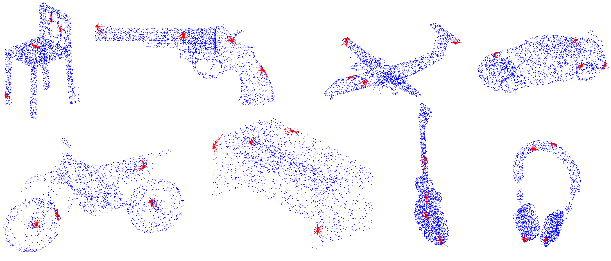

# ODFNet

Implementation of "ODFNet: Using orientation distribution functions to characterize 3D point clouds" (https://www.sciencedirect.com/science/article/abs/pii/S0097849321001801).

Please contact sahinyu@itu.edu.tr for further details. 



## Semantic Segmentation

To train ODFNet for semantic segmentation of S3DIS:

```sh
$ python semseg_main.py <area_id>
```

For inference:

```sh
$ python semseg_test_all.py
```
